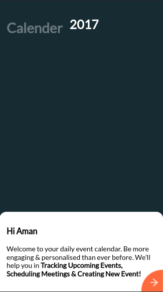
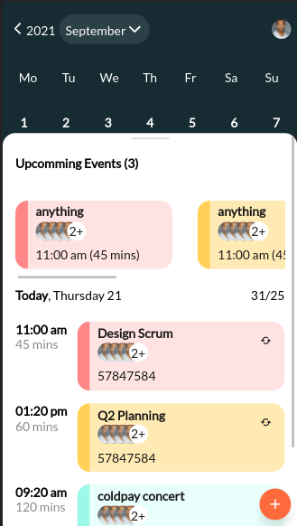
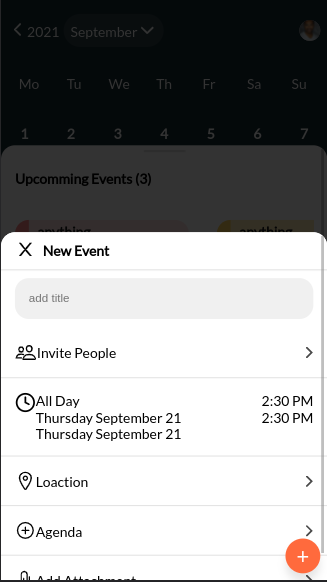

# pamfur-task

The Front End Assigment

[View Live on Codesanbox](https://codesandbox.io/s/github/youngsterjaidev/pamfur-task)

## Installation

- Clone the Repositry
- npm install
- npm start

## Notes
